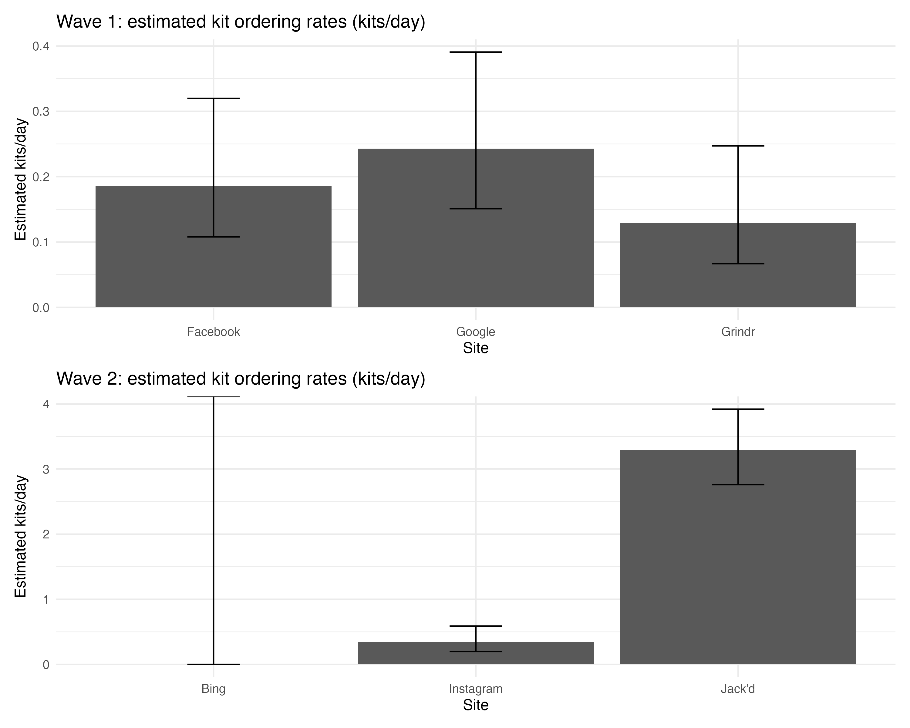

# 540 Case Study 1

This repository reproduces key results from the manuscript **Relative Effectiveness of Social Media, Dating Apps, and Information Search Sites in Promoting HIV Self testing** using the final dataset from the NIDA page and the accompanying data dictionary.

The replication covers three components from the manuscript
Table 1
Primary analysis for the test kit ordering outcome
Secondary analysis for selected survey items

The final dataset used for the replication is stored as `data/ctn_final.sas7bdat`. The main outputs are written to the `output` folder.

## Study overview

Online advertisements were placed on different kinds of platforms to encourage HIV self testing among young minority men who have sex with men who were at increased risk of HIV infection. The idea is that different online platforms reach different audiences, so the ordering rate of HIV self test kits may differ across platforms.

The primary objective is to compare the effectiveness of specific platforms in promoting HIV self test kit ordering, using the test kit order rate as a proxy for effectiveness. The secondary objective is to assess whether participant characteristics and survey responses differ between people who ordered a test kit and people who did not order a test kit.

## Replicated Table 1

Below is the replicated Table 1 summary for the per protocol sample. The file is saved as `output/table1_replication.csv`.

```
Age in years, median (IQR)    25 (21 to 27)
Ethnicity, n (%)
  Hispanic/Latinx    66 (26.0)
Race, n (%)
  American Indian or Alaskan Native    1 (0.4)
  Black or African American    196 (78.4)
  White    28 (11.2)
  Other    14 (5.6)
  Multiracial    11 (4.4)
History of PrEP uptake, n (%)
  Never taken PrEP    232 (91.3)
  In the past 6 months    22 (8.7)
Number of male sex partners in the past 90 days, median (IQR)    4 (3 to 6)
Condom use, n (%)
  Never    36 (14.2)
  Sometimes    108 (42.5)
  About half the time    37 (14.6)
  Most of the time    68 (26.8)
  Always    5 (2.0)
Condomless receptive anal sex in the past 90 days, n (%)    210 (82.7)
Ever tested for HIV during lifetime, n (%)    191 (75.2)
If tested for HIV, median (IQR)
  Months since last HIV test    11 (6 to 21)
If not tested for HIV, n (%)    63 (24.8)
```

A quick data check used during replication confirmed the cohort size and ordering count used in the primary outcome analysis
Per protocol sample size 254
Number who ordered 177

## Replicated results

### Primary analysis

The primary outcome is the HIV self test kit ordering rate, computed as number of orders divided by number of advertising days within each wave and site. The replicated counts and rates are saved as `output/primary_table2_replicated.csv`.

```
Wave 1
  Facebook    days 70    orders 13    rate 0.186 kits per day
  Google    days 70    orders 17    rate 0.243 kits per day
  Grindr    days 70    orders 9    rate 0.129 kits per day
Wave 2
  Instagram    days 38    orders 13    rate 0.342 kits per day
  Jack'd    days 38    orders 125    rate 3.289 kits per day
  Bing    days 38    orders 0    rate 0.000 kits per day
```

These rates match the manuscript pattern
Wave 1 shows similar ordering rates across the three sites in that wave and the manuscript reports no statistically significant differences across the Wave 1 platforms.
Wave 2 shows a much higher ordering rate for Jackd compared with Instagram and Bing and the manuscript reports statistically significant differences across Wave 2 sites.

A visualization of the estimated ordering rates is included in the repository as `output/bonus_figure_rates.png`.



### Secondary analysis

The manuscript reports that test kit ordering was associated with responses to three HIV related belief items. I targeted those three items and reproduced the same p values pattern within rounding. The targeted variables are listed in `output/secondary_target_vars.csv`.

Targeted items and replicated p values
People would leave if I had HIV, p value about 0.04
I think that new HIV or AIDS treatments can eradicate the virus from your body, p value about 0.03
I could not be friends with someone who has HIV or AIDS, p value about 0.03

## Reflection

Overall, the replication was successful for the required components. The cohort counts and the site level ordering rates match the manuscript results, and the key secondary p values align with the reported values within small rounding differences. One practical challenge is that the primary outcome includes a site with zero orders in Wave 2, which can make some model based comparisons sensitive to the exact modeling and contrast implementation. In addition, the manuscript notes that a later promotion wave during the early public health emergency period was excluded from analysis because no participants enrolled and the model became inestimable, which is important context for why the replication focuses on the first two waves.

## References

Stafylis C, Vavala G, Wang Q, et al. Relative Effectiveness of Social Media, Dating Apps, and Information Search Sites in Promoting HIV Self testing Observational Cohort Study. JMIR Formative Research. 2022.

NIDA Clinical Trials Network data page for this case study and the final dataset with data dictionary
[https://nida.nih.gov](https://nida.nih.gov)

R package documentation used for marginal means and contrasts
[https://cran.r-project.org/package=emmeans](https://cran.r-project.org/package=emmeans)


